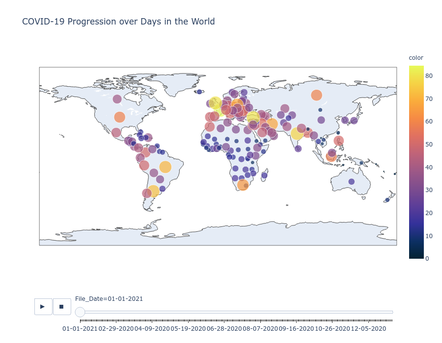

## Covid-19 Data Analysis and Visualisation


Data Source: The Data is aquired from the John Hopkins Github Data Repository found through kaggle.

__Index:__

1. [Disclaimer](#Disclaimer)
1. [Introduction](#Introduction)
1. [Scope](#Scope)
1. [Requirements](#Requirements)
    1. [Python Dependencies](Python-Dependencies)
    1. [Data Source](Data-Source)
1. [Data Acquisition](#Data-Acquisition)
1. [Data Processing and Cleaning](#Data-Processing-Cleaning)
    1. [Filling Null Values](#Fil_null)
    1. [Changing Column DataTypes](#Changing-Column-DataTypes)
    1. [Adding Enrichment columns](#Adding-Enrichment-columns)
1. [Data Visualization](#Data-Visualization)
    1. [COVID-19 Cases Progression Over Days in the World](#COVID-world-map)
    1. [COVID-19 Cases Progression In UK, Spain, France, Russia, Brazil, India, US](#COVID-top-7-map)
    1. [Covid-19 Top 7 countries](#COVID-top-7-bar)
1. [Further Scope](#Future-Scope)
1. [Resources](#Resources)
---
__Result:__<br>





---

<a id='Disclaimer'></a>

***Disclaimer!!*** <br>
Ran into issues with running the notebook in Browser without hanging the browser.<br>
The Notebook Executes perfectly in VS code But Plottly animations doesnot work. <br>
<br>
The Only way to make the code run and check the animations is running the code in .py file in the Main directory Folder.
<br>
Still working on the root cause!!!

---

<a id="Introduction"></a>

## Introduction

The data set used for the Data Analysis is the John Hopkins Covid-19 Data repository.
The data is downloaded from the [John Hopkins github data repository](https://github.com/CSSEGISandData/COVID-19)

<br>

The Covid Cases are documented and reported by the JohnHopkins University as Daily Reports and Time Series Data sets.<br>
For the process of analysing and visualising the data the numpy, pandas, plotly packages are used in the process.<br>
<br>
---
<br>

<a id="Scope"></a>

## Scope

To Analyze the Covid-19 confirmed cases in the world and the Top countries at risk.


<br>
---
<br>
<a id="Requirements"></a>

## Requirements

<br>
Inorder to successfully conduct the analysis<br>
The Required Python Modules<br>

1. Pandas
1. Numpy
1. Plottly
 
The Required DataSet to work on<br>


### Python Dependencies

```
!pip3 install numpy pandas plotly
```

<br>
---
<br>

<a id="Data-Acquisition"></a>

## 3. Data Acquisition


Download the Datafrom the following links:<br><br>
 https://github.com/CSSEGISandData/COVID-19 <br>
 https://github.com/CSSEGISandData/COVID-19/tree/master/csse_covid_19_data/csse_covid_19_daily_reports/


The Data is downloaded and saved in the local Current Working Directory in a new folder DataSource. <br>
But the data in the Daily reports folder are CSV files.<br>
<br>
The files naming convention:<br>
"MM-DD-YYYY.csv"<br>

Since the files follow same naming format and type <br>
The data can be loaded in to a data frame through a loop

__or__
we can directly load the data from the github repository as they update the data.

---
<a id="Data-Processing-Cleaning"></a>

## 3.A Data Processing and Cleaning

<a id="Fil_null"></a>
### Filling Null values

The data frame has two Country region columns one of the columns needs to be filled with the other and drop the other column.

<a id="Changing-Column-DataTypes"></a>

### Changing Column DataTypes

<a id="Adding-Enrichment-columns"></a>

### Adding Enrichment columns

### Data Transformation

<a id="Data-Visualization"></a>
---
## Data Visualization

[Top](#Introduction)

<a id="COVID-world-map"></a>
---
### COVID-19 Cases Progression Over Days in the World

<a id="COVID-top-7-map"></a>
---
### COVID-19 Cases Progression In UK, Spain, France, Russia, Brazil, India, US

<a id="COVID-top-7-Bar"></a>
---
### COVID-19 Cases Bar Plot for UK, Spain, France, Russia, Brazil, India, US'